# README

[JPEC](https://www.jpec2012.jp)のコンテンツ生成プログラム(static site generator)

## セットアップ

サイト作成

```shell
hugo new site hugo-jpec2012
```

レポジトリ初期化

```shell
cd hugo-jpec2012
git init
echo '*~' >> .gitignore
echo '*.bak' >> .gitignore
echo '*.orig' >> .gitignore
echo '.env' >> .gitignore
echo 'public' >> .gitignore
echo 'resources' >> .gitignore
```

テーマ設定(submoduleはhttpsプロトコルで追加)

```shell
git submodule add https://github.com/pacollins/hugo-future-imperfect-slim.git themes/future-imperfect-slim
```

(参考)submoduleの削除

```shell
git submodule deinit -f themes/future-imperfect-slim
git rm themes/future-imperfect-slim
rm -fr .git/modules/future-imperfect-slim
```

サイト設定

```shell
cp themes/future-imperfect-slim/exampleSite/config.toml .
```

config.toml

```toml
baseURL = "https://example.com/"
languageCode = "en-us"
defaultContentLanguage = "ja"
title = "My New Hugo Site"
theme = "future-imperfect-slim"
```

> Github PagesやNetlifyで使う場合はbaseURLのプロトコルはhttpsにすること

起動確認(http://localhost:1313)

```shell
cp /path/to/someplace/Makefile .
make run
```

### GraphCMSとの連携

#### トークンの発行

* `GRAPHCMS_ENDPOINT`: ダッシュボード>`Settings`>`Endpoints`
* `GRAPHCMS_TOKEN`
  * `Permanent Auth Tokens`にて以下を設定して`Create`
    * `Name`: jpec-website
    * `Content from stage Published`: チェック

#### コンテンツの取得

コンテンツの取得は[Python Script](./app/main.py)で実施

### Github

#### レポジトリ

Github管理画面のダッシュボードでレポジトリ作成後

```shell
git remote add origin git@github.com:jpec-website/hugo-future-imperfect-slim.git
git add .
git commit -m 'first commit'
git branch -M main
git push -u origin main
```

#### Webhook

Gihub Actionsの設定

* [workflows](./.github/workflows/gh-pages.yaml)の設定
* 以下の`Secrets`を登録
  * `GRAPHCMS_ENDPOINT`
  * `GRAPHCMS_TOKEN`

Webhookの設定

* ダッシュボード>右上のユーザアイコン>`Settings`>`Developper Settings`>`Personal accesss tokens`>`Generate new token`
  * `Note`: jpec2012.jp
  * `Select scopes`: 一番上の`repo`にチェック

[Rest Client for VS Code](./test.http)で確認できる

GraphCMS側の設定(**Github Actionsに対応していないので中継サーバに投げる**)
<sup id="a1">[(1)](#f1)</sup>

* ダッシュボード>`Webhooks`>`Create`
* 以下を設定
  * Name: jpec-website/hugo-jpec2012
  * Description: jpec-website/hugo-jpec2012
  * Include payload: Off
  * Url: <中継サーバのエンドポイント>
  * Triggers
    * Content Model: postとpageを選択
    * Stage: Published
  * Headers: None

<b id="f1">(1)</b> Github ActionsのWebhookではpayloadにevent_typeが必須だがGraphcmsでは設定できない(2021/5/6)  [↩](#a1)

#### Github Pages

* ダッシュボード>`Settings`>`Pages`
    * `Custom domain`: jpec2012.jp
    * `Enforce HTTPS`にチェック(すぐにできない場合はGithub側のチェックを待つ)

[スクリーンショットで確認](./images/screenshot/github-pages.png)

##### DNS(さくらインターネット)側の設定

サーバコントロールパネル ホーム>左サイドバー>ドメイン/SSl>ネームサーバ設定>ゾーン>編集

###### ゾーン情報変更前

| エントリー        | タイプ | データ         | TTL |
| ----------------- | ------ | -------------- | --- |
| @                 | NS     | ns1.dns.ne.jp. | -   |
| @                 | NS     | ns2.dns.ne.jp. | -   |
| @                 | MX     | 10 @           | -   |
| @                 | A      | 49.212.235.158 | -   |
| www               | CNAME  | @              | -   |
| mail              | CNAME  | @              | -   |
| ftp               | CNAME  | @              | -   |

digで確認

```shell
dig jpec2012.jp +noall +answer -t A
...
jpec2012.jp.		105	IN	A	49.212.235.158
```

###### ゾーン情報変更後

| エントリー        | タイプ | データ          | TTL |
| ----------------- | ------ | --------------  | --- |
| @                 | NS     | ns1.dns.ne.jp.  | -   |
| @                 | NS     | ns2.dns.ne.jp.  | -   |
| @                 | MX     | 10 @            | -   |
| @                 | A      | 185.199.108.153 | -   |
| @                 | A      | 185.199.109.153 | -   |
| @                 | A      | 185.199.110.153 | -   |
| @                 | A      | 185.199.111.153 | -   |
| www               | CNAME  | @               | -   |
| mail              | CNAME  | @               | -   |
| ftp               | CNAME  | @               | -   |

[スクリーンショットで確認](./images/screenshot/sakura-zone-info.png)

変更が反映するのにしばらく時間を要する。

```shell
dig jpec2012.jp +noall +answer -t A
...
jpec2012.jp.		3600	IN	A	185.199.109.153
jpec2012.jp.		3600	IN	A	185.199.108.153
jpec2012.jp.		3600	IN	A	185.199.111.153
jpec2012.jp.		3600	IN	A	185.199.110.153
```

## ワークフロー

GraphCMSでコンテンツを更新したらWebhookをさくらのアプリに通知し、Github Actionsを発火させGithub Pagesがビルドされる



## デザイン

### 基本のテンプレート

* layouts/_default/baseof.html
  * 全ページで使われるBase Template
  * ここでページのカラムレイアウトなどを設計し各パーツを読み込む
* layouts/index.html
  * トップページ
  * 存在しない場合は以下のlist.htmlを呼び出す
* layouts/_default/list.html
  * セクションやTaxonomy(カテゴリーやタグ等のグルーピング)ごとの記事一覧ページ
* layouts/_default/single.html
  * 記事個別ページ
  * ブログ本文

### future-imperfect-slimのテンプレート構成

* 基本構成
  * layouts/_default/baseof.html: 大本の基本レイアウト
    * layouts/partials/head.html: htmlのheadタグ
      * layouts/partials/meta.html: htmlのheadタグ内のmeta情報
    * layouts/partials/site-header.html: サイト共通のヘッダーセクション
      * layouts/partials/theme-notification.html: テーマ配給元のお知らせ
        * layouts/partials/theme-message.md: 上記から呼び出されるメッセージ
      * layouts/partials/language-menu.html: 言語メニュー表示用ドロップダウン
    * layouts/partials/site-intro.html: サイドバー上部のサイト情報
      * layouts/partials/rss-icon.html
      * layouts/partials/socnet-icon.html
    * layouts/partials/site-sidebar.html: サイト共通のサイドバー
    * layouts/partials/site-footer.html: サイト共通のフッタセクション
      * layouts/partials/rss-icon.html
      * layouts/partials/socnet-icon.html
    * layouts/partials/scripts.html: javascriptの読み込み
* セクション
  * layouts/_default/about.html: aboutレイアウト
  * layouts/_default/contact.html: contactレイアウト
  * layouts/_default/terms.html: termsレイアウト
* リスト
  * layouts/_default/list.html
    * layouts/_default/content-list.html(.Render)
* 個別ページ
  * layouts/_default/single.html: 個別ページ
    * layouts/_default/header.html: 個別ページのヘッダ(.Render)
      * layouts/_default/date.html: ヘッダの日付(.Rneder)
      * layouts/_default/date.nl.html; ヘッダの日付(オランダ語)(.Rneder)
    * layouts/partials/share-buttons.html: シェアボタン
    * layouts/_default/featured.html: 特集コンテンツ(.Render)
    * layouts/_default/stats.html(.Render)
    * layouts/_default/comments.html(.Render)
* その他
  * layouts/_default/index.json.json: 全文検索用ファイル(**要確認**)

## Link

* [Hugo Future Imperfect Slim \| Hugo Themes](https://themes.gohugo.io/hugo-future-imperfect-slim/)
* [Running static site builds with GitHub Actions and Contentful \| Contentful](https://www.contentful.com/blog/2020/06/01/running-static-site-builds-with-github-actions-and-contentful/)
* [Managing a custom domain for your GitHub Pages site \- GitHub Docs](https://docs.github.com/en/pages/configuring-a-custom-domain-for-your-github-pages-site/managing-a-custom-domain-for-your-github-pages-site)
* [GitHub Pagesの独自ドメインHTTPS化対応 \- Qiita](https://qiita.com/shiruco/items/b504365371f18bfae7c8)
* [Creating an image gallery with Hugo and Lightbox2 \- Christian Specht](https://christianspecht.de/2020/08/10/creating-an-image-gallery-with-hugo-and-lightbox2/)
* [Hugo のレイアウトの仕組み \- Marbles Day](https://marbles.hatenablog.com/entry/2020/11/22/204751)
* [タクソノミー関連のテンプレートを定義する \| まくまくHugo/Goノート](https://maku77.github.io/hugo/taxonomy/template.html)
* [各種ページにおいて \.Kind や \.IsPage、\.IsSection、\.IsNode の値がどうなるかの一覧 \| まくまくHugo/Goノート](https://maku77.github.io/hugo/template/page-types.html)
* [インスタグラム投稿の埋め込み方法と使用時の注意点 \| SEO研究所サクラサクラボ](https://www.sakurasaku-labo.jp/blogs/instagram-seo#%E3%82%A4%E3%83%B3%E3%82%B9%E3%82%BF%E3%82%B0%E3%83%A9%E3%83%A0%E6%8A%95%E7%A8%BF%E3%81%AE%E5%85%AC%E5%BC%8F%E5%9F%8B%E3%82%81%E8%BE%BC%E3%81%BF%E6%96%B9%E6%B3%95)
* [Swiper\.jsの使い方「レスポンシブ等の具体例」とオプション解説](https://stand-4u.com/web/javascript/swiper.html)
* [高機能なスライダー”Swiper”の紹介と使い方 \| Web\-saku](https://web-saku.net/swiper_introduction/)
